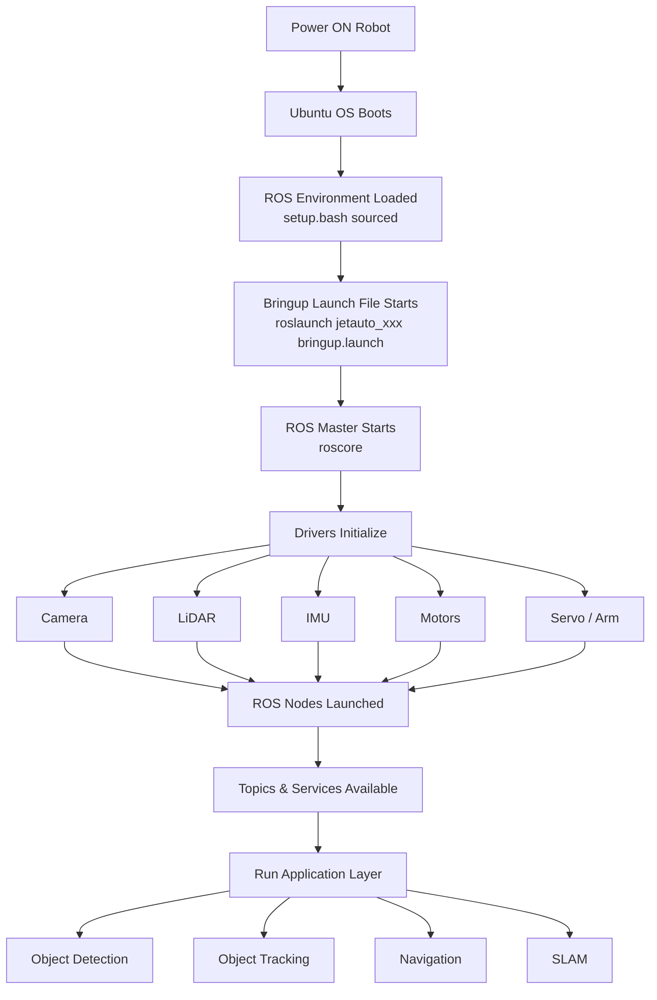

 
# JetAuto Pro — System Architecture  

> Full boot-to-application software stack, and how to inspect what the `bringup` launch file actually starts.
> **ROS Melodic** · Workspace: `~/jetauto_ws` · Jetson Nano

## Table of Contents
1. [System Architecture Overview](#1-system-architecture-overview)
2. [Architecture Layers Explained](#2-architecture-layers-explained)
3. [Inspecting the Bringup Launch File](#3-inspecting-the-bringup-launch-file)
4. [Typical Nodes Started by Bringup](#4-typical-nodes-started-by-bringup)
5. [Topics & Services After Bringup](#5-topics--services-after-bringup)
6. [Application Layer](#6-application-layer)

---

## 1. System Architecture Overview



---

## 2. Architecture Layers Explained

| Layer | What Happens | Key File / Command |
|---|---|---|
| **1. Power ON** | Jetson Nano boots from SD/eMMC | — |
| **2. Ubuntu OS** | Ubuntu 18.04 kernel + services start | `systemctl status` |
| **3. ROS Environment** | Workspace env vars loaded into shell | `source ~/jetauto_ws/devel/setup.bash` |
| **4. Bringup Launch** | Master launch file is triggered (often on boot via systemd/autostart, or manually) | `roslaunch jetauto_bringup bringup.launch` (exact package/name to confirm — see Section 3) |
| **5. ROS Master** | `roscore` starts (usually auto-started inside the bringup launch via `<master>` or implicitly) | `rosnode list` to confirm it's up |
| **6. Drivers Initialize** | Each hardware driver node starts: camera, LiDAR, IMU, motor controller, servo controller | See driver paths from the [Driver Documentation Guide] |
| **7. Nodes Launched** | All driver + utility nodes register with the master | `rosnode list` |
| **8. Topics & Services** | Sensor topics and control services become available for subscription | `rostopic list`, `rosservice list` |
| **9. Application Layer** | Higher-level packages (detection, tracking, nav, SLAM) subscribe to topics and publish commands | `roslaunch jetauto_app <app>.launch` |

---
## 3. Inspecting the Bringup Launch File

Actual trace performed on the robot (`jetauto@jetauto-desktop`):

### Step 1 — List All Packages in the Workspace
```bash
cd ~/jetauto_ws/src
ls
```
**Output (real packages on this robot):**
```
jetauto_app          jetauto_driver        jetauto_multi         jetauto_simulations
c_asr_offline        jetauto_example       jetauto_navigation    jetauto_slam
jetauto_bringup      jetauto_calibration   jetauto_interfaces    jetauto_peripherals
third_party
```

### Step 2 — Enter the Bringup Package
```bash
cd jetauto_bringup
ls
```
**Output:**
```
CMakeLists.txt  launch  package.xml  scripts  service
```
> The `service` folder is the giveaway — this package also manages a **systemd service**, not just a launch file. See Step 4.

### Step 3 — Enter the Launch Folder
```bash
cd launch
ls
```
**Output:**
```
bringup.launch  rosbridge.launch
```

### Step 4 — Read bringup.launch
```bash
cat bringup.launch
```
**Key contents found:**
```xml
<?xml version="1.0"?>
<!-- 此launch文件被设定为自启动，自启动文件路径：/etc/systemd/system/start_app_node.service
     method: systemd
     (This launch file is set as auto-start. The path of the auto-start file is
     /etc/systemd/system/start_app_node.service, method: systemd) -->

<launch>
    <!-- 自定义usb摄像头名称 (custom usb camera name) -->
    <arg name="usb_cam_name" default="usb_cam"/>

    <!-- 自定义深度摄像头名称 (custom depth camera name) -->
    <arg name="depth_camera_name" default="astra_cam"/>

    <!-- 自定义深度摄像头rgb话题名称 (custom depth camera rgb topic name) -->
    <arg name="image_topic" default="image_raw"/>

    <!-- 获取设备类型，具体类型在~/.typerc里定义
         (Acquire the device type. The specific type is defined in ~/.typerc) -->
    <!-- ... file continues, paste the rest after running cat on your robot ... -->
</launch>
```

> **Important finding:** `bringup.launch` is wired to **`start_app_node.service`** — a systemd service. This means bringup is normally started **automatically on boot**, not by manually running `roslaunch`. Manage it with:

| Action | Command |
|---|---|
| Stop auto-start (until next reboot) | `sudo systemctl stop start_app_node.service` |
| Start it now (until next reboot) | `sudo systemctl start start_app_node.service` |
| Disable auto-start permanently | `sudo systemctl disable start_app_node.service` |
| Enable auto-start permanently | `sudo systemctl enable start_app_node.service` |
| Restart it | `sudo systemctl restart start_app_node.service` |
| Check current status | `sudo systemctl status start_app_node.service` |

### Step 5 — See the Full Argument / Include List
```bash
# View the rest of the file (it was cut off above)
cat ~/jetauto_ws/src/jetauto_bringup/launch/bringup.launch | less

# Pull out just the <arg> definitions (camera/device names, topics)
grep -n "<arg name" ~/jetauto_ws/src/jetauto_bringup/launch/bringup.launch

# Pull out every <include> — these are the real driver launch files being pulled in
grep -n "<include\|file=" ~/jetauto_ws/src/jetauto_bringup/launch/bringup.launch

# Also check the second launch file in this package
cat ~/jetauto_ws/src/jetauto_bringup/launch/rosbridge.launch
```
 
```bash
# Recursively trace every included launch file from bringup
python3 - <<'EOF'
import re, os

start = os.path.expanduser("~/jetauto_ws/src/PACKAGE_NAME/launch/bringup.launch")
seen = set()

def trace(path, depth=0):
    if path in seen or not os.path.exists(path):
        return
    seen.add(path)
    print("  " * depth + f"-> {path}")
    txt = open(path, errors="ignore").read()
    for inc in re.findall(r'file="\$\(find (\w+)\)/(.*?)"', txt):
        pkg, rel = inc
        # crude resolve - adjust WS path if packages aren't directly under src/<pkg>
        guess = os.path.expanduser(f"~/jetauto_ws/src/{pkg}/{rel}")
        trace(guess, depth + 1)

trace(start)
EOF
```

---

## 4. Typical Nodes Started by Bringup

Fill this in once you've traced Section 3 on your actual robot:

| Driver | Node Name | Launch File | Hardware Port |
|---|---|---|---|
| Camera | `_____` | `_____.launch` | `/dev/video__` |
| LiDAR | `_____` | `_____.launch` | `/dev/ttyUSB__` |
| IMU | `_____` | `_____.launch` | `/dev/ttyUSB__` / I2C |
| Motor Control | `_____` | `_____.launch` | `/dev/ttyUSB__` |
| Servo / Arm | `_____` | `_____.launch` | `/dev/ttyUSB__` |
| Robot Description | `robot_state_publisher` | `_____.launch` | — |

---

## 5. Topics & Services After Bringup

```bash
# Once bringup is running, list everything live
rostopic list
rosservice list
rosnode list

# Check publish rate of a sensor topic (confirms driver is alive)
rostopic hz /scan
rostopic hz /camera/rgb/image_raw
rostopic hz /imu/data
```

| Common Topic | Published By | Typical Use |
|---|---|---|
| `/scan` | LiDAR driver | Obstacle detection, SLAM |
| `/camera/rgb/image_raw` | Camera driver | Object detection/tracking |
| `/imu/data` | IMU driver | Orientation, odometry fusion |
| `/cmd_vel` | Navigation / teleop | Motor control input |
| `/odom` | Motor controller | Position estimate |
| `/joint_states` | Servo/arm driver | Arm position feedback |

---

## 6. Application Layer

Everything above is infrastructure — the application layer is what you actually run on top of it:

| Application | Subscribes To | Publishes To |
|---|---|---|
| Object Detection | `/camera/rgb/image_raw` | `/detected_objects` |
| Object Tracking | `/camera/rgb/image_raw`, `/detected_objects` | `/tracked_objects` |
| Navigation | `/scan`, `/odom`, `/map` | `/cmd_vel` |
| SLAM | `/scan`, `/odom`, `/imu/data` | `/map` |

```bash
# Launch an application on top of an already-running bringup
roslaunch jetauto_app object_detection.launch
roslaunch jetauto_navigation navigation.launch
roslaunch jetauto_slam slam.launch
```

 
